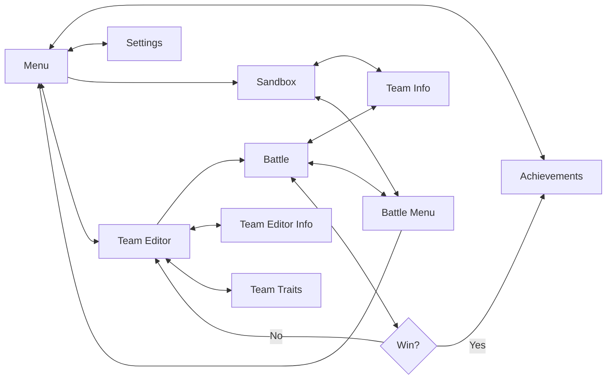
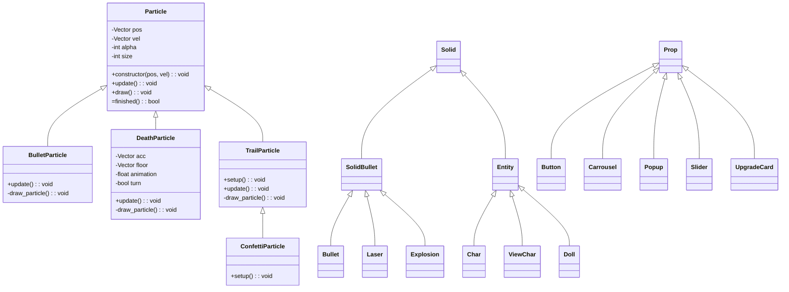

# Deity of Glyphs

Play it on [Itch.io](https://technotopus.itch.io/deity-of-glyphs)

Web game made with [p5.js](https://p5js.org/) and has support for _phone_ and _computer_.

This is my first **complete** game, I hope you enjoy it as much as I did while developing this game.

If you find any bugs feel free to comment or open an issue in github. I will take a look as soon as I can.

### Game Flow Chart

### Class Inheritance

